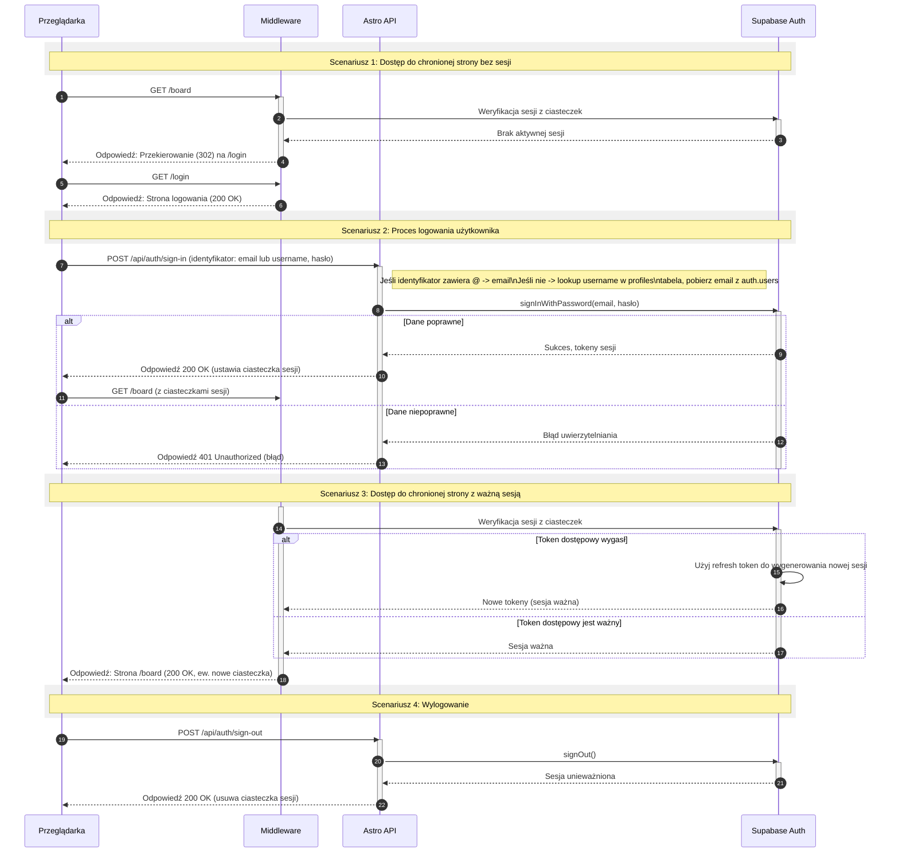

<authentication_analysis>

### 1. Przepływy autentykacji

Na podstawie dokumentacji zidentyfikowano następujące kluczowe przepływy autentykacji:

- **Rejestracja pierwszego użytkownika (Administratora)**: Specjalny proces, który ma miejsce tylko wtedy, gdy baza danych użytkowników jest pusta. Pierwszy zarejestrowany użytkownik automatycznie otrzymuje rolę `Administrator`.
- **Logowanie standardowego użytkownika**: Użytkownicy uwierzytelniają się za pomocą adresu e-mail i hasła.
- **Dostęp do chronionych zasobów**: System weryfikuje, czy użytkownik ma aktywną sesję przed udzieleniem dostępu do chronionych stron (np. `/board`). W przypadku braku sesji, użytkownik jest przekierowywany na stronę logowania.
- **Wylogowanie**: Proces unieważniania sesji użytkownika i usuwania ciasteczek sesyjnych.
- **Weryfikacja i odświeżanie tokenu**: Automatyczny proces zarządzany przez Supabase SSR SDK i middleware, który zapewnia ciągłość sesji bez konieczności ponownego logowania, nawet po wygaśnięciu tokenu dostępowego.

### 2. Główni aktorzy i ich interakcje

- **Przeglądarka (Browser)**: Klient użytkownika końcowego. Inicjuje żądania do stron Astro i endpointów API.
- **Middleware (Astro)**: Warstwa pośrednicząca, która przechwytuje wszystkie przychodzące żądania. Odpowiada za weryfikację sesji i ochronę tras.
- **Astro API**: Backend aplikacji, który obsługuje logikę biznesową związaną z uwierzytelnianiem (rejestracja, logowanie, wylogowanie).
- **Supabase Auth**: Zewnętrzna usługa uwierzytelniająca, która zarządza użytkownikami, hasłami, sesjami i tokenami JWT.

### 3. Procesy weryfikacji i odświeżania tokenów

Proces jest w dużej mierze zautomatyzowany przez bibliotekę `@supabase/ssr`. Gdy `Middleware` otrzymuje żądanie, używa klienta Supabase do weryfikacji sesji na podstawie ciasteczek (`sb-access-token` i `sb-refresh-token`). Jeśli token dostępowy wygasł, ale token odświeżający jest nadal ważny, klient Supabase automatycznie kontaktuje się z `Supabase Auth` w celu uzyskania nowego zestawu tokenów. Nowe tokeny są następnie ustawiane w odpowiedzi do przeglądarki, co zapewnia płynne działanie sesji.

### 4. Opis kroków autentykacji

Poniższy diagram ilustruje sekwencję zdarzeń dla dwóch głównych scenariuszy: próby dostępu do chronionej strony bez aktywnej sesji oraz procesu logowania.

1.  **Dostęp do chronionej strony (niezalogowany)**: Użytkownik próbuje wejść na `/board`. Middleware wykrywa brak sesji i przekierowuje go na `/login`.
2.  **Proces logowania**: Użytkownik podaje dane w formularzu, które są wysyłane do Astro API. API komunikuje się z Supabase Auth. Po pomyślnej weryfikacji Supabase ustawia ciasteczka sesji, a przeglądarka zostaje przekierowana na docelową stronę `/board`.
3.  **Dostęp do chronionej strony (zalogowany)**: Przy kolejnym żądaniu do `/board`, Middleware weryfikuje poprawność sesji z Supabase Auth i zezwala na dostęp.
4.  **Wylogowanie**: Użytkownik klika przycisk "Wyloguj", co wysyła żądanie do Astro API, które z kolei instruuje Supabase Auth, aby unieważnił sesję i usunął ciasteczka.

</authentication_analysis>

