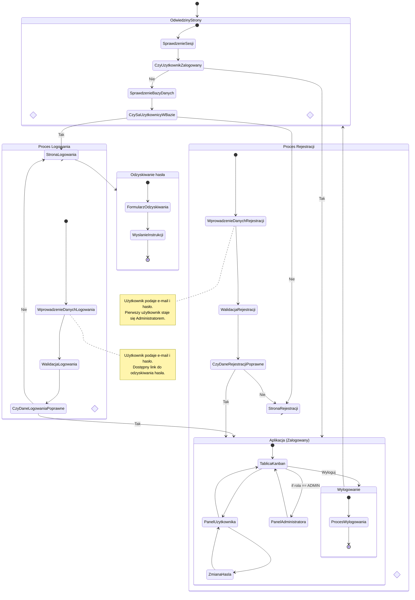

<mermaid_diagram>

```mermaid
stateDiagram-v2
    direction TB

    [*] --> OdwiedzinyStrony

    state OdwiedzinyStrony {
        [*] --> SprawdzenieSesji
        SprawdzenieSesji --> CzyUzytkownikZalogowany

        state "Użytkownik zalogowany?" as CzyUzytkownikZalogowany <<choice>>
        CzyUzytkownikZalogowany --> AplikacjaZalogowany : Tak
        CzyUzytkownikZalogowany --> SprawdzenieBazyDanych : Nie

        SprawdzenieBazyDanych --> CzySaUzytkownicyWBazie
        state "Czy są użytkownicy w bazie?" as CzySaUzytkownicyWBazie <<choice>>
        CzySaUzytkownicyWBazie --> StronaLogowania : Tak
        CzySaUzytkownicyWBazie --> StronaRejestracji : Nie
    }

    StronaLogowania --> Logowanie
    StronaRejestracji --> Rejestracja

    state "Proces Logowania" as Logowanie {
        [*] --> WprowadzenieDanychLogowania
        note right of WprowadzenieDanychLogowania
            Użytkownik podaje e-mail i hasło.
            Dostępny link do odzyskiwania hasła.
        end note
        WprowadzenieDanychLogowania --> WalidacjaLogowania
        WalidacjaLogowania --> CzyDaneLogowaniaPoprawne

        state "Dane logowania poprawne?" as CzyDaneLogowaniaPoprawne <<choice>>
        CzyDaneLogowaniaPoprawne --> AplikacjaZalogowany : Tak
        CzyDaneLogowaniaPoprawne --> StronaLogowania : Nie
    }

    state "Aplikacja (Zalogowany)" as AplikacjaZalogowany {
         [*] --> TablicaKanban
         TablicaKanban --> PanelUzytkownika
         PanelUzytkownika --> TablicaKanban
         PanelUzytkownika --> ZmianaHasla
         ZmianaHasla --> PanelUzytkownika
         TablicaKanban --> PanelAdministratora : if rola == ADMIN
         PanelAdministratora --> TablicaKanban
         TablicaKanban --> Wylogowanie : Wyloguj
    }

    state "Proces Rejestracji" as Rejestracja {
        [*] --> WprowadzenieDanychRejestracji
        note right of WprowadzenieDanychRejestracji
            Użytkownik podaje e-mail i hasło.
            Pierwszy użytkownik staje się Administratorem.
        end note
        WprowadzenieDanychRejestracji --> WalidacjaRejestracji
        WalidacjaRejestracji --> CzyDaneRejestracjiPoprawne

        state "Dane rejestracji poprawne?" as CzyDaneRejestracjiPoprawne <<choice>>
        CzyDaneRejestracjiPoprawne --> AplikacjaZalogowany : Tak
        CzyDaneRejestracjiPoprawne --> StronaRejestracji : Nie
    }

    state "Odzyskiwanie hasła" as OdzyskiwanieHasla {
        [*] --> FormularzOdzyskiwania
        FormularzOdzyskiwania --> WyslanieInstrukcji
        WyslanieInstrukcji --> [*]
    }

    state "Wylogowanie" as Wylogowanie {
        [*] --> ProcesWylogowania
        ProcesWylogowania --> [*]
    }

    StronaLogowania --> OdzyskiwanieHasla
    Wylogowanie --> OdwiedzinyStrony
```

</mermaid_diagram>
