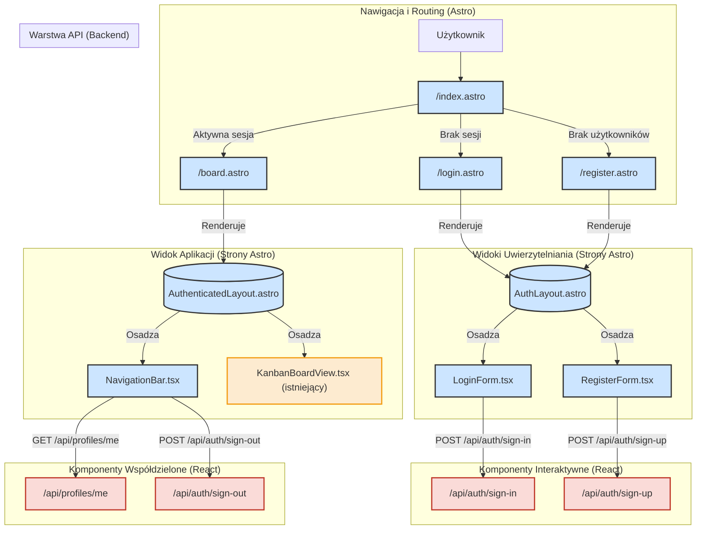

<architecture_analysis>
Na podstawie dostarczonych dokumentów (`prd.md` i `auth-spec.md`) oraz analizy obecnego kodu, opracowano architekturę interfejsu użytkownika dla modułu uwierzytelniania i autoryzacji.

### 1. Zidentyfikowane komponenty i strony

**Nowe Strony (Astro):**

- `src/pages/register.astro`: Strona do rejestracji pierwszego użytkownika (administratora). Dostępna tylko, gdy w systemie nie ma żadnego użytkownika.
- `src/pages/login.astro`: Strona logowania dla istniejących użytkowników.
- `src/pages/board.astro`: Główny widok aplikacji (tablica Kanban), dostępny po zalogowaniu. Zastąpi obecną stronę `index.astro`.
- `src/pages/index.astro`: Strona główna, która będzie działać jako router, przekierowując użytkowników do `/login` lub `/board` w zależności od stanu uwierzytelnienia.

**Nowe Layouty (Astro):**

- `src/layouts/AuthLayout.astro`: Minimalistyczny layout dla stron `login.astro` i `register.astro`, centrujący zawartość.
- `src/layouts/AuthenticatedLayout.astro`: Rozszerzony layout dla zalogowanych użytkowników, zawierający `NavigationBar.tsx`.

**Nowe Komponenty (React):**

- `src/components/auth/LoginForm.tsx`: Formularz logowania z walidacją (`zod`, `react-hook-form`) i komunikacją z API (`/api/auth/sign-in`).
- `src/components/auth/RegisterForm.tsx`: Formularz rejestracji z walidacją i komunikacją z API (`/api/auth/sign-up`).
- `src/components/layout/NavigationBar.tsx`: Pasek nawigacyjny dla zalogowanych użytkowników, wyświetlający dane użytkownika (z hooka `useUser`) i opcję wylogowania.

**Istniejące komponenty do aktualizacji:**

- Żadne istniejące komponenty nie wymagają bezpośredniej aktualizacji w ramach tego modułu, ponieważ jest on tworzony od podstaw. `AuthenticatedLayout.astro` będzie nową wersją głównego layoutu.

### 2. Główne strony i ich komponenty

- **Strona Logowania (`/login`):**
  - Layout: `AuthLayout.astro`
  - Komponent: `LoginForm.tsx`
- **Strona Rejestracji (`/register`):**
  - Layout: `AuthLayout.astro`
  - Komponent: `RegisterForm.tsx`
- **Tablica Kanban (`/board`):**
  - Layout: `AuthenticatedLayout.astro` (zawierający `NavigationBar.tsx`)
  - Komponenty: `KanbanBoardView.tsx` (istniejący)

### 3. Przepływ danych

1.  **Użytkownik niezalogowany** trafia na `index.astro`.
2.  Middleware (`src/middleware/index.ts`) przechwytuje żądanie, sprawdza brak sesji i przekierowuje na `/login` (lub `/register`, jeśli baza jest pusta).
3.  Użytkownik wchodzi na `/login`, gdzie `login.astro` renderuje `LoginForm.tsx` wewnątrz `AuthLayout.astro`.
4.  `LoginForm.tsx` po wypełnieniu wysyła dane do endpointu `/api/auth/sign-in`.
5.  Po pomyślnym zalogowaniu, API ustawia ciasteczka sesji, a strona klienta przekierowuje użytkownika na `index.astro`.
6.  Tym razem middleware (`src/middleware/index.ts`) wykrywa aktywną sesję i przekierowuje na `/board`.
7.  `board.astro` jest renderowane z użyciem `AuthenticatedLayout.astro`.
8.  `AuthenticatedLayout.astro` zawiera `NavigationBar.tsx`.
9.  `NavigationBar.tsx` używa hooka `useUser`, który odpytuje endpoint `/api/profiles/me`, aby pobrać dane zalogowanego użytkownika i je wyświetlić.

### 4. Opis funkcjonalności komponentów

- **`LoginForm.tsx`**: Renderuje pola identyfikatora (email lub nazwa użytkownika) i hasło, waliduje je po stronie klienta i obsługuje komunikację z serwerem w celu uwierzytelnienia użytkownika. Wyświetla błędy walidacji i błędy z API.
- **`RegisterForm.tsx`**: Podobnie jak `LoginForm.tsx`, ale dla procesu rejestracji. Waliduje dodatkowo siłę hasła.
- **`NavigationBar.tsx`**: Komponent UI wyświetlający nawigację, nazwę użytkownika i przycisk wylogowania. Dane pobiera asynchronicznie, aby uniezależnić się od serwerowego renderowania strony.
- **`AuthLayout.astro`**: Zapewnia spójny, minimalistyczny wygląd dla formularzy uwierzytelniania, bez zbędnych elementów interfejsu.
- **`AuthenticatedLayout.astro`**: Główny "szkielet" aplikacji dla zalogowanego użytkownika, zawierający wspólne elementy jak nawigacja.

</architecture_analysis>

